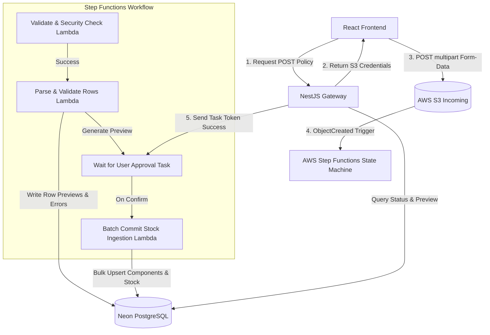
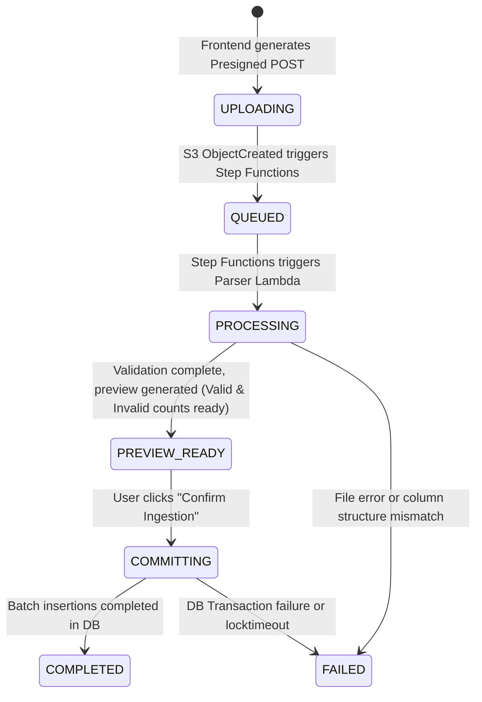

# Phase 2 Technical Architecture: Serverless Batch Ingestion Pipeline

This document defines the comprehensive system design and technical specifications for **Phase 2: AWS Serverless Integration**. It outlines direct S3 Presigned POST uploads, direct XLSX streaming within Lambda (negating CSV conversions), AWS Step Functions orchestration, security controls, database state machines, and detailed row-level failure handling.

---

## 1. System Architecture Overview

To transition from the local in-memory NestJS processing model to a cloud-native, scalable pipeline, we will deploy a hybrid architecture combining a NestJS API gateway with serverless processing units.



---

## 2. Presigned POST Policy Integration

Instead of standard `Presigned PUT` URLs, we will use **S3 Presigned POST Policies**. Presigned POST allows the frontend to upload files via standard `multipart/form-data` POST requests, enforcing strict backend-defined security policies directly at the S3 API level.

### Why Presigned POST?
1. **Fine-grained Constraints:** We can restrict `Content-Length` (file size) and `Content-Type` (MIME types) directly in the S3 signature policy. S3 will immediately reject uploads that violate these constraints before consuming serverless execution time.
2. **Standard Upload Forms:** Simpler integration on the React frontend using standard HTML `FormData` constructs.

### NestJS S3 Metadata Signature Payload
When the frontend requests upload credentials via `/api/imports/presigned-post`, the backend uses the `@aws-sdk/s3-presigned-post` library to construct the signature:

```typescript
// Proposed NestJS Service Logic
import { createPresignedPost } from "@aws-sdk/s3-presigned-post";
import { S3Client } from "@aws-sdk/client-s3";

const s3Client = new S3Client({ region: process.env.AWS_REGION });

export async function generatePresignedPost(fileName: string, branchId: string, userId: string) {
  const fileKey = `imports/${branchId}/${Date.now()}-${fileName}`;
  
  const presigned = await createPresignedPost(s3Client, {
    Bucket: process.env.S3_BUCKET_NAME!,
    Key: fileKey,
    Conditions: [
      ["content-length-range", 1024, 20971520], // Enforce min 1KB, max 20MB file size
      ["eq", "$Content-Type", "application/vnd.openxmlformats-officedocument.spreadsheetml.sheet"], // Strictly enforce XLSX
    ],
    Fields: {
      "Content-Type": "application/vnd.openxmlformats-officedocument.spreadsheetml.sheet",
      "x-amz-meta-branch-id": branchId,
      "x-amz-meta-user-id": userId,
    },
    ExpiresIn: 900, // 15 Minutes
  });

  return {
    url: presigned.url,
    fields: presigned.fields, // Contains Policy, Signature, Credential, etc.
    importJobId: "will-be-created-in-database"
  };
}
```

---

## 3. XLSX Parsing Research: Stream vs. CSV Conversion

### Technical Evaluation: Can we process XLSX directly in AWS Lambda?
*   **Yes.** We **do not need** to convert XLSX to CSV before processing.
*   The primary risk of direct XLSX parsing in Lambda is **memory exhaustion**. A standard XLSX file is a compressed ZIP archive containing highly descriptive XML structures. Loading a 10MB XLSX file into memory using domestic parsers (like `xlsx` or in-memory `exceljs`) can expand to 200MB - 500MB of RAM, causing low-tier Lambdas to crash.
*   **The Solution:** Use **SAX/Event-driven Streaming**. The `exceljs` library includes a specialized streaming reader `ExcelJS.stream.xlsx.WorkbookReader` which reads files row-by-row directly from an input stream (such as a read stream from S3).
*   **Result:** The memory profile remains constant (typically <128MB) regardless of whether the file has 500 rows or 50,000 rows. **Therefore, direct XLSX streaming is highly performant and requires NO CSV conversion.**

### Sample Event-Driven Stream Parsing Code in Lambda
```typescript
import { S3Client, GetObjectCommand } from "@aws-sdk/client-s3";
import * as ExcelJS from "exceljs";

const s3 = new S3Client({});

async function streamParseXlsx(bucket: string, key: string, onRow: (row: any, rowNumber: number) => Promise<void>) {
  const response = await s3.send(new GetObjectCommand({ Bucket: bucket, Key: key }));
  const inputStream = response.Body as NodeJS.ReadableStream;

  const workbookReader = new ExcelJS.stream.xlsx.WorkbookReader(inputStream, {
    entries: "emit",
    sharedStrings: "cache",
    styles: "ignore",
    hyperlinks: "ignore",
    worksheets: "emit"
  });

  for await (const worksheetReader of workbookReader) {
    for await (const row of worksheetReader) {
      // row.values contains the cells. Index 1-based.
      await onRow(row.values, row.number);
    }
  }
}
```

---

## 4. Full AWS Step Functions Workflow

We will orchestrate the serverless ingestion pipeline using **AWS Step Functions**. This guarantees transactional states, retry/error fallback boundaries, and lets us leverage `Task Tokens` to halt the pipeline until the human user confirms the import.

### State Machine Definition

```json
{
  "Comment": "StockFlow Electronics Batch Import Pipeline",
  "StartAt": "ValidateAndSecurityCheck",
  "States": {
    "ValidateAndSecurityCheck": {
      "Type": "Task",
      "Resource": "arn:aws:lambda:region:account:function:ValidateFile",
      "Next": "IsFileValid"
    },
    "IsFileValid": {
      "Type": "Choice",
      "Choices": [
        {
          "Variable": "$.isValid",
          "BooleanEquals": true,
          "Next": "ParseAndValidateRows"
        }
      ],
      "Default": "MarkJobFailed"
    },
    "ParseAndValidateRows": {
      "Type": "Task",
      "Resource": "arn:aws:lambda:region:account:function:ParseAndValidateRows",
      "Next": "WaitForUserApproval"
    },
    "WaitForUserApproval": {
      "Type": "Task",
      "Resource": "arn:aws:states:::lambda:invoke.waitForTaskToken",
      "Parameters": {
        "FunctionName": "arn:aws:lambda:region:account:function:RegisterApprovalToken",
        "Payload": {
          "importJobId.$": "$.importJobId",
          "taskToken.$": "$$.Task.Token"
        }
      },
      "Next": "BatchCommitStock"
    },
    "BatchCommitStock": {
      "Type": "Task",
      "Resource": "arn:aws:lambda:region:account:function:BatchCommitStock",
      "End": true
    },
    "MarkJobFailed": {
      "Type": "Task",
      "Resource": "arn:aws:lambda:region:account:function:MarkJobFailed",
      "End": true
    }
  }
}
```

---

## 5. Database State Machine & Import Lifecycle

The import lifecycle will transition through granular states in the database (`Prisma`) to provide real-time updates and logs to the frontend via polling or WebSockets.

### State Transitions (Enum `ImportStatus` Updates)



### Granular Fields & Counts
We will track the progress inside the `ImportJob` table:
*   `status`: Current import status (enum).
*   `totalRows`: Total spreadsheet rows identified.
*   `processedRows`: Rows compiled through validator so far.
*   `validRows`: Count of rows satisfying schema specs.
*   `invalidRows`: Count of rows with schema or semantic errors.
*   `committedRows`: Rows successfully committed to physical inventory.

---

## 6. Granular Row Validation & Error Logging

### Row Validation Stage
As rows are streamed through the **Parse & Validate Lambda**, each row undergoes two layers of verification:
1. **Schema Check (Zod):** Strict type validations, required fields, and category specs (e.g. CPU vs RAM constraints).
2. **Semantic Check (Prisma):** Ensuring the SKU has appropriate specifications. If the SKU exists in the DB, it does not need to submit specs again (only quantity and price).

### Error Logging Strategy (skip-and-log)
If a row fails validation:
1. **Do not fail the entire job.**
2. Increment `invalidRows` count.
3. Save the invalid row to `ImportJobRow` with status `INVALID` and save the Zod/semantic error details in the `errorMessage` column (JSON/text).
4. For valid rows, write them to `ImportJobRow` with status `VALID` and save the `normalizedData` block ready for insertion.

### Bulk Commit Phase (Batching)
When the user approves:
1. Update `ImportJob` status to `COMMITTING`.
2. The batching script reads only `VALID` rows from `ImportJobRow` for this `importJobId`.
3. Ingest rows in batches of **500 items** using Prisma `$transaction` blocks to ensure extremely fast performance and prevent DB timeouts.
4. If a batch contains database failures (e.g. unique constraints or integrity issues):
   * Capture the error.
   * Mark individual failed rows as `FAILED` with details.
   * Continue with the remaining batches so valid data is not completely locked out.
5. Finally, update the `ImportJob` to `COMPLETED` and update the `committedRows` counter.

---

## 7. Lambda Functions Detailed Technical Specification

To match the existing project structure, all lambda function codebase files reside inside the `apps/lambdas/` workspace, allowing modular testing, dependency separation, and independent deployment cycles.

```
apps/lambdas/
├── import-validator/       # Security & File Integrity Check (ValidateFile)
│   ├── index.ts
│   └── package.json
├── import-parser/          # Stream XLSX Parsing & Zod Schema checking (ParseAndValidate)
│   ├── index.ts
│   └── package.json
└── import-writer/          # Database Ingestion & Chunk Ingestion (BatchCommitStock)
    ├── index.ts
    └── package.json
```

### 7.1. Lambda 1: `apps/lambdas/import-validator`
*   **Role:** Security validation, MIME check, spreadsheet format evaluation, and initial column header consistency check.
*   **Input Event (S3 ObjectCreated Event):**
    ```json
    {
      "Records": [{
        "s3": {
          "bucket": { "name": "stockflow-imports" },
          "object": { "key": "imports/BR001/1716298100-components.xlsx", "size": 14205 }
        }
      }]
    }
    ```
*   **Handler Logic:**
    1. Extract bucket name and key. Parse the metadata headers (`x-amz-meta-branch-id`, `x-amz-meta-user-id`).
    2. Check the file extension. Must strictly be `.xlsx`.
    3. Check the file size. Reject if file size is empty (`size === 0`) or exceeds `20MB` to prevent DDoS/resource exhaustion.
    4. Fetch the first few bytes from S3 to read the XLSX workbook columns structure using a fast header reader.
    5. Ensure primary columns (`sku`, `name`, `category`, `quantity`) exist in the first sheet.
    6. If validation passes: Write an `ImportJob` record in the database with status `QUEUED` and return `{ isValid: true, importJobId: "uuid-from-db", bucket, key }`.
    7. If validation fails: Write `ImportJob` with status `FAILED`, store the file check error in the job log, and return `{ isValid: false }`.

---

### 7.2. Lambda 2: `apps/lambdas/import-parser`
*   **Role:** Standalone event-driven XLSX stream parsing, row-level Zod validations, database row staging, and preview preparation.
*   **Input Payload (From Validate State):**
    ```json
    {
      "importJobId": "job-uuid-12345",
      "bucket": "stockflow-imports",
      "key": "imports/BR001/1716298100-components.xlsx"
    }
    ```
*   **Handler Logic:**
    1. Update database `ImportJob` status from `QUEUED` to `PROCESSING`.
    2. Download stream from S3 and load it row-by-row using `ExcelJS.stream.xlsx.WorkbookReader`.
    3. Loop through rows:
        *   Extract row cell values and align them to the column keys.
        *   Compute the unique SHA256 `idempotencyKey` based on: `sha256(importJobId:rowNumber:sku)` to prevent double processing.
        *   Validate the row fields using the **Category-specific Zod Schema**.
        *   **Validation Success:** Write to `ImportJobRow` with status `VALID`, saving the normalized data inside `normalizedData`.
        *   **Validation Error:** Increment the job's `invalidRows` count, write `ImportJobRow` with status `INVALID`, and save the Zod validation message in `errorMessage`.
    4. Upon stream completion:
        *   Update the `ImportJob` in the database to `PREVIEW_READY`, storing the final counts (`totalRows`, `validRows`, `invalidRows`).
        *   Return the Step Functions state payload: `{ importJobId: "job-uuid-12345", status: "PREVIEW_READY" }`.

---

### 7.3. Lambda 3: `apps/lambdas/import-writer`
*   **Role:** Bulk transactional database writer utilizing chunks of 500 records to perform efficient updates into `Inventory`, `Component`, and `StockMovement`.
*   **Input Payload (Step Functions state after User Approval TaskToken):**
    ```json
    {
      "importJobId": "job-uuid-12345",
      "action": "CONFIRM"
    }
    ```
*   **Handler Logic:**
    1. Check if the action is `CONFIRM`. If `CANCEL`, update `ImportJob` status to `CANCELLED` and terminate.
    2. Update `ImportJob` status to `COMMITTING`.
    3. Retrieve all staged rows from `ImportJobRow` for this `importJobId` where `validationStatus === "VALID"`.
    4. Split the rows into processing chunks of **500 rows**.
    5. Loop through each chunk and run inside a high-speed database transaction (`Prisma.$transaction`):
        *   Upsert the component record (master metadata).
        *   Increment/update the physical stock in `Inventory` for the targeted branch.
        *   Write an `IMPORT_IN` entry in the `StockMovement` ledger table for auditing.
        *   Update the `ImportJobRow` records status to `COMMITTED`.
    6. Update database counters dynamically: show `processedRows` / `committedRows` count progress (e.g. `2500 / 3000 rows committed`).
    7. Once completed: Update `ImportJob` status to `COMPLETED` and record the processing duration.

---

## 8. Deployment and Packaging Strategy

### Building with the Monorepo Structure
We compile all Lambda functions using **esbuild** to bundle their dependencies (including `@prisma/client` and `@aws-sdk/client-s3`) into a single, optimized JavaScript file, ensuring sub-100ms cold start times.

### Infrastructure-as-Code (CDK / Terraform)
We define the AWS Step Functions workflow and deploy the three Lambdas inside the `infrastructure/` workspace utilizing **AWS Cloud Development Kit (CDK)** or **Terraform**, mapping:
*   `ValidateFile` Lambda $\rightarrow$ `apps/lambdas/import-validator`
*   `ParseAndValidateRows` Lambda $\rightarrow$ `apps/lambdas/import-parser`
*   `BatchCommitStock` Lambda $\rightarrow$ `apps/lambdas/import-writer`

---

## 9. SFN Human Approval Integration & Task Token Exchange

To halt the AWS Step Functions pipeline until the user confirms or cancels the import preview, we use the `waitForTaskToken` pattern. 

### Step 1: Storing the Task Token
When the `WaitForUserApproval` state is triggered, SFN halts the execution and invokes the `RegisterApprovalToken` lambda:
1. The lambda receives the unique `taskToken` from the execution context.
2. It writes the `taskToken` directly to the `ImportJob` record in the database:
   ```typescript
   await prisma.importJob.update({
     where: { id: importJobId },
     data: { awsTaskToken: taskToken },
   });
   ```

### Step 2: Triggering Execution Continuation (NestJS Backend)
When the user clicks **Confirm Import** on the Next.js UI, the frontend calls the NestJS endpoint `/api/imports/:id/confirm`.
NestJS retrieves the stored `awsTaskToken` and uses the `@aws-sdk/client-sfn` client to resume the Step Functions state machine:

```typescript
import { SFNClient, SendTaskSuccessCommand } from "@aws-sdk/client-sfn";

const sfnClient = new SFNClient({ region: process.env.AWS_REGION });

export async function confirmImport(importJobId: string) {
  const job = await prisma.importJob.findUnique({ where: { id: importJobId } });
  if (!job || !job.awsTaskToken) throw new BadRequestException("No active waiting token found");

  await sfnClient.send(new SendTaskSuccessCommand({
    taskToken: job.awsTaskToken,
    output: JSON.stringify({ importJobId, action: "CONFIRM" }),
  }));

  // Update DB status immediately to COMMITTING so UI changes status
  await prisma.importJob.update({
    where: { id: importJobId },
    data: { status: "COMMITTING", awsTaskToken: null }, // Clear token after consumption
  });
}
```

---

## 10. Serverless Database Connection Pooling (Neon pgBouncer)

### The Challenge
AWS Lambda scales out rapidly. If 20 instances of `import-parser` or `import-writer` run concurrently, they will attempt to open 20 separate database connections. A standard serverless PostgreSQL instance (like Neon or AWS RDS) has tight connection limits, leading to immediate database connection exhaustion:
`Error: P2024 - Prisma Client: Connection pool timeout`

### The Solution: Neon Transaction Pooling
1. We must configure our backend and lambdas to use Neon's **Transaction Pooling** port (`pgbouncer`) instead of direct session ports.
2. Update the `DATABASE_URL` in environment configurations to include the pooling port (typically port `5432` or pooler domain in Neon) and append `&pgbouncer=true&connection_limit=1`:

```ini
# Direct Session connection URL (used strictly for migration and seeding)
DIRECT_DATABASE_URL="postgresql://neondb_owner:npg...aws.neon.tech/neondb?sslmode=require"

# Pooled Connection URL (used by lambdas & NestJS runtime)
DATABASE_URL="postgresql://neondb_owner:npg...aws.neon.tech/neondb?sslmode=require&pgbouncer=true&connection_limit=1"
```
3. Setting `connection_limit=1` in AWS Lambda tells each cold-start Lambda instance to strictly hold **exactly 1 connection** in its internal pool, allowing hundreds of concurrent Lambdas to operate smoothly.

---

## 11. Real-Time Status Updates: SWR Polling Strategy

Since WebSocket persistence is complex and costly to manage over serverless Lambdas, we implement a highly optimized **Client-Side Polling Strategy** using Next.js, SWR (or React Query), and NestJS.

### Ingestion Status Polling
*   **Mechanism:** When an import job is running (`UPLOADING`, `QUEUED`, `PROCESSING`, `COMMITTING`), the frontend polls the lightweight endpoint `/api/imports/:id/status` every **2 seconds**.
*   **Backend Optimization:** The `/api/imports/:id/status` query performs a non-blocking SELECT of *only* the state and counters (`validRows`, `invalidRows`, `committedRows`, `totalRows`), completing in <5ms.
*   **Stopping Criteria:** The SWR hook automatically halts polling once the status transitions to `PREVIEW_READY`, `COMPLETED`, or `FAILED`.

```typescript
// Proposed Next.js React Hook utilizing SWR
import useSWR from "swr";

export function useImportStatus(jobId: string | null) {
  const { data, error } = useSWR(
    jobId ? `/api/imports/${jobId}/status` : null,
    fetcher,
    {
      refreshInterval: (data) => 
        ["COMPLETED", "FAILED", "PREVIEW_READY", "CANCELLED"].includes(data?.status) ? 0 : 2000,
    }
  );
  return { status: data, isLoading: !error && !data, error };
}
```

---

## 12. Fault Tolerance & Recovery: DLQ & Replays

If any stage of the import fails (e.g. S3 file corrupted, Lambda execution timeout, database outage):
1. **AWS SQS Dead Letter Queue (DLQ):** Every Lambda function is configured with an SQS queue as a DLQ to capture failed S3 events or SFN payloads.
2. **DLQ Replay Worker:** The folder `apps/lambdas/dlq-replay/` contains a lightweight worker script to download messages from the SQS DLQ, resolve the root issue, and trigger redelivery of events back into the Step Functions state machine once database/system health is restored.


